# ML Pipeline on Adult Income Dataset

## 📌 Project Overview
This project applies various classification models and sampling techniques to the UCI Adult Income dataset. The goal is to evaluate the impact of different sampling methods on performance metrics such as accuracy, recall, precision, F1-score, and ROC-AUC.

The pipeline supports baseline training, comparison of 4 sampling techniques, and optional dimensionality reduction via LDA.

---

## ⚙️ Requirements
Install dependencies using:
```bash
pip install -r requirements.txt
```

### `requirements.txt`
```
pandas
numpy
matplotlib
seaborn
scikit-learn
imblearn
```

---

## 🧠 Models Used
- Logistic Regression (`logreg`)
- Random Forest (`random_forest`)
- K-Nearest Neighbors (`knn`)
- Gradient Boosting (`gradient_boost`)

> SVM was removed due to slow training.

---

## 🔁 Sampling Techniques Included
- Random Oversampling
- SMOTE (Synthetic Minority Oversampling Technique)
- Random Undersampling
- Tomek Links

Each model is tested with all sampling methods.

---

## 📊 Summary of Test Results
Test Config: `test_size=0.3`, `random_state=66`, `scaler=minmax`, `apply_lda=True`

### Logistic Regression (logreg)
| Method                 | Accuracy | Precision | Recall | F1-score | ROC-AUC |
|------------------------|----------|-----------|--------|----------|---------|
| Baseline               | 0.8543   | 0.7418    | 0.6059 | 0.6670   | 0.9055  |
| Random Oversampling    | 0.8071   | 0.5661    | 0.8525 | 0.6804   | 0.9058  |
| SMOTE                  | 0.8108   | 0.5748    | 0.8236 | 0.6770   | 0.9009  |
| Random Undersampling   | 0.8021   | 0.5582    | 0.8537 | 0.6751   | 0.9044  |
| Tomek Links            | 0.8503   | 0.6983    | 0.6662 | 0.6819   | 0.9046  |
| LDA                    | 0.8405   | 0.7153    | 0.5608 | 0.6287   | 0.8925  |

### Random Forest
| Method                 | Accuracy | Precision | Recall | F1-score | ROC-AUC |
|------------------------|----------|-----------|--------|----------|---------|
| Baseline               | 0.8547   | 0.7341    | 0.6220 | 0.6734   | 0.9037  |
| Random Oversampling    | 0.8446   | 0.6758    | 0.6815 | 0.6787   | 0.8999  |
| SMOTE                  | 0.8357   | 0.6439    | 0.7105 | 0.6756   | 0.8947  |
| Random Undersampling   | 0.8079   | 0.5688    | 0.8350 | 0.6767   | 0.9027  |
| Tomek Links            | 0.8522   | 0.6949    | 0.6884 | 0.6916   | 0.9032  |
| LDA                    | 0.7762   | 0.5346    | 0.5455 | 0.5400   | 0.8163  |

### KNN
| Method                 | Accuracy | Precision | Recall | F1-score | ROC-AUC |
|------------------------|----------|-----------|--------|----------|---------|
| Baseline               | 0.8246   | 0.6524    | 0.5816 | 0.6150   | 0.8434  |
| Random Oversampling    | 0.7700   | 0.5148    | 0.7751 | 0.6187   | 0.8316  |
| SMOTE                  | 0.7892   | 0.5456    | 0.7457 | 0.6301   | 0.8377  |
| Random Undersampling   | 0.7679   | 0.5114    | 0.8121 | 0.6276   | 0.8528  |
| Tomek Links            | 0.8201   | 0.6192    | 0.6569 | 0.6375   | 0.8453  |
| LDA                    | 0.8171   | 0.6373    | 0.5574 | 0.5947   | 0.8333  |

### Gradient Boost
| Method                 | Accuracy | Precision | Recall | F1-score | ROC-AUC |
|------------------------|----------|-----------|--------|----------|---------|
| Baseline               | 0.8683   | 0.7934    | 0.6122 | 0.6911   | 0.9208  |
| Random Oversampling    | 0.8221   | 0.5893    | 0.8614 | 0.6998   | 0.9209  |
| SMOTE                  | 0.8243   | 0.5986    | 0.8206 | 0.6923   | 0.9132  |
| Random Undersampling   | 0.8179   | 0.5824    | 0.8614 | 0.6949   | 0.9203  |
| Tomek Links            | 0.8678   | 0.7520    | 0.6730 | 0.7103   | 0.9204  |
| LDA                    | 0.8384   | 0.7160    | 0.5446 | 0.6187   | 0.8890  |

---

## 🖼️ Confusion Matrices and Visuals
> All confusion matrices and plots are available in the `results/` folder.

### 🔢 Distribution
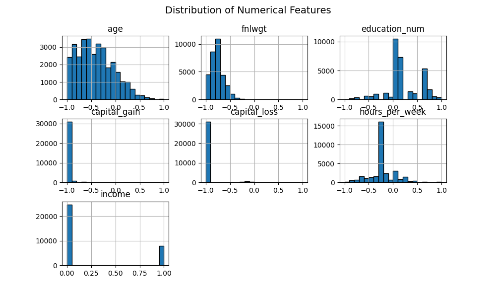
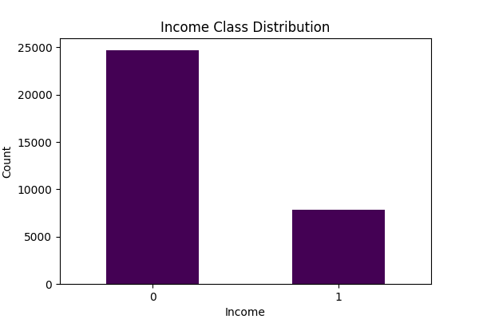

### 📌 Baseline Confusion Matrices


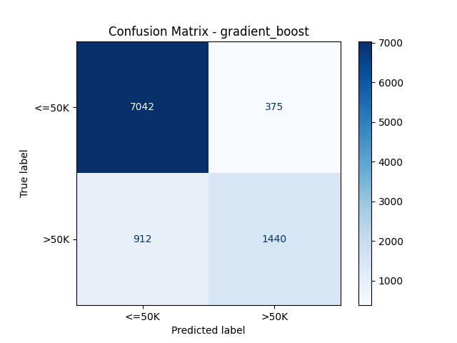

### 🔁 Sampling Results (Examples)
- **Logreg**:
  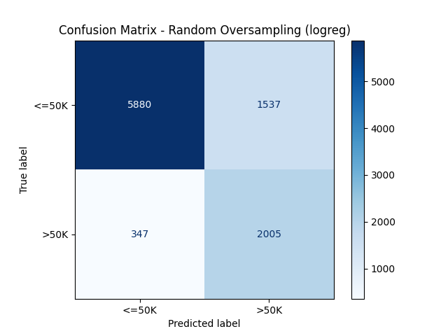
  
  
  

- **Random Forest**:
  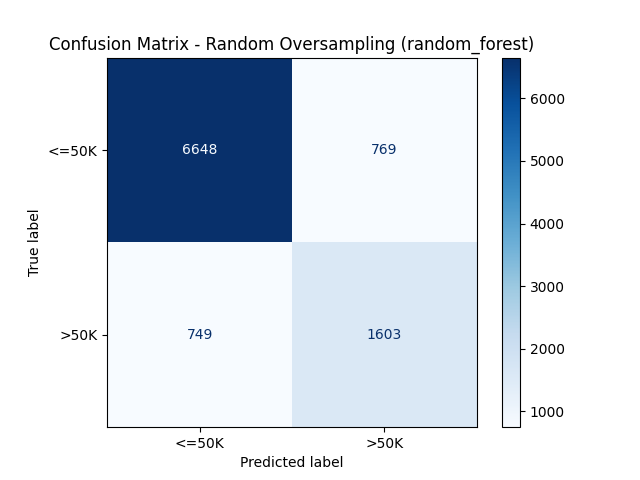
  
  
  

- **KNN**:
  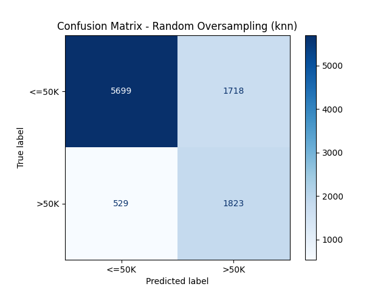
  
  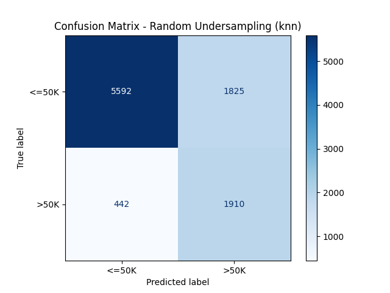
  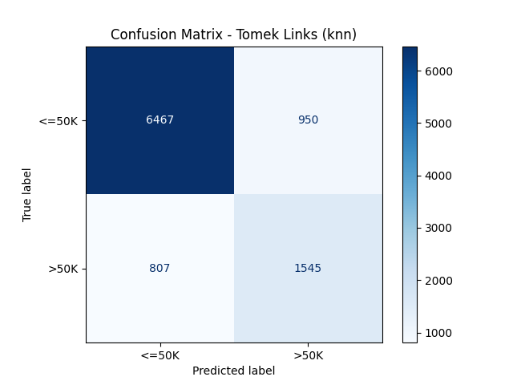

- **Gradient Boost**:
  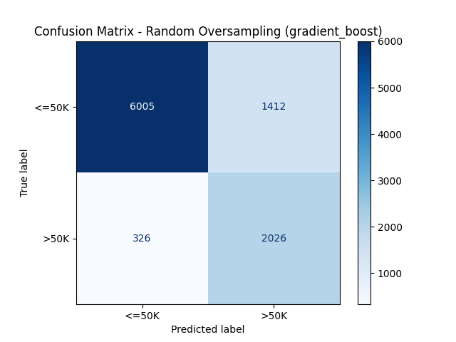
  
  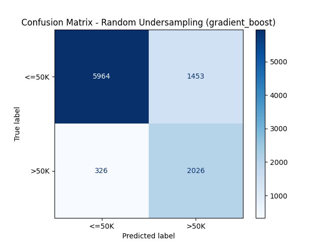
  

### 📉 LDA-Based Models

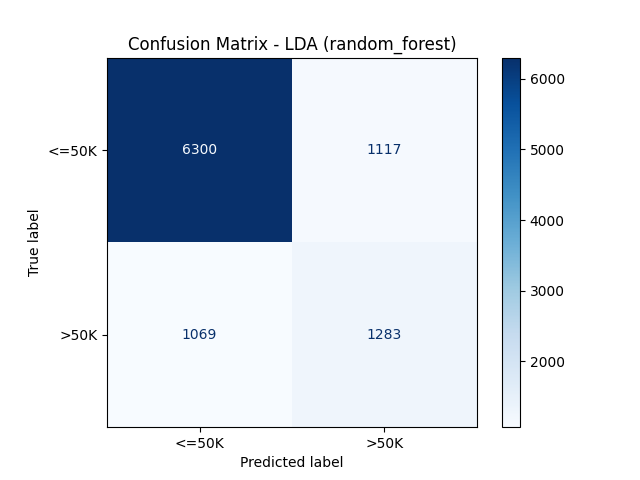


---

## ⏱️ Time Efficiency Summary
- Logistic Regression (sampling): **~12.04s**
- Gradient Boost (sampling): **~31.95s**
- Random Forest (LDA): **~5.72s**
- KNN (LDA): **~2.39s**

Each model tracks its own duration for performance comparison.

---

## 🚀 How to Run
Just execute the script:
```bash
python Main.py
```
You'll be prompted for:
- Test size (e.g. 0.3)
- Random seed
- Model type (or `all`)
- Sampling method (or `all`)
- LDA option (True/False)

Outputs include printed metrics and confusion matrix images saved to `results/`.

---

## 📂 Outputs Generated
- 26 Confusion Matrix PNG files
- `Distribution_of_Numerical_Features.png`
- `Income_Class_Distribution.png`

---

## 📌 Future Work
- Add cross-validation support
- Enable more preprocessing options
- Integrate automatic report generator (PDF/HTML)

---

Created by: **Mesut Erkin Özokutgen**
